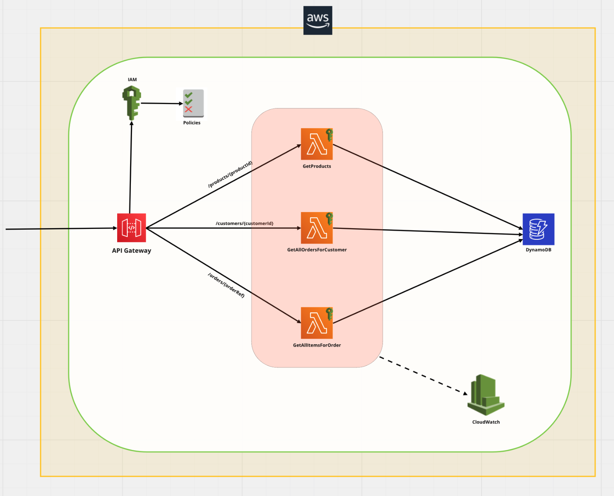
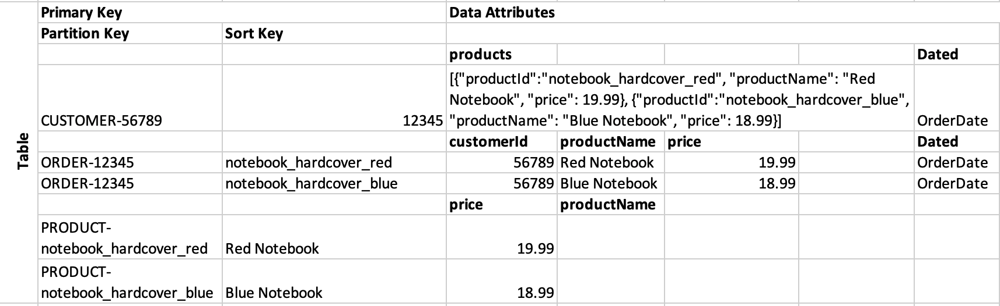
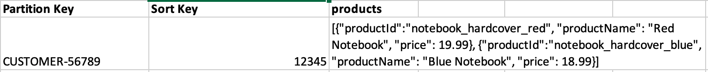
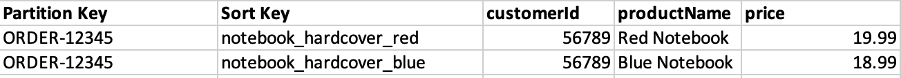
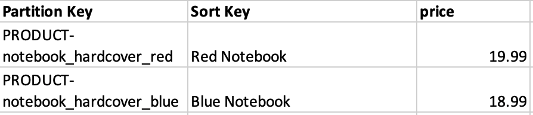

# Online Print Orders Service API

The purpose of this API is to expose orders details with the following queries:
* Get the price and name for a given product
* Get all the items for a given order
* Get all the orders for a given customer

## Assumptions
1. An order record can not contain duplicate products.

## System Architecture
In order to achieve our purpose with minimum maintenance effort, I decided to go with a serverless solution. The following advantages led me come up with this architecture.
- no server management required
- automatically scale from zero to peak demands
- lower cost
- consistent performance with AWS Serverless Platform have built-in fault tolerance and availability



### API Gateway:
When The API Gateway is invoked with a REST request, it will proxy the related Lambda Function according to the path URI. <br/>
I preferred IAM authentication for the APIs in the API Gateway. API Gateway invokes the API route only if the client has execute-api permission for the route.<br/>

### Security:
Additional to the IAM authentication in the API Gateway, the Lambda Functions will have an execution role with an IAM policy that authorizes to Read/Query from DynamoDB table and upload its log to The CloudWatch. <br/>
Managed policies are given below:
- **AWSLambdaBasicExecutionRole** – Upload logs to CloudWatch
- **AWSLambdaDynamoDBExecutionRole** – Read from DynamoDB Streams

### Logging & Monitoring:
CloudWatch Logs:
* AWS Lambda execution logs will be stored in AWS CloudWatch Logs

CloudWatch Metrics:
* AWS Lambda and DynamoDB metrics will be displayed in AWS CloudWatch Metrics such as
  * Invocations, Durations, Concurrent Executions
  * Error count, Success Rates, Throttles
  * ConsumedReadCapacityUnits, ThrottledRequests, etc. 

### Data storage
Example dataset is given below

| customerId  |  orderRef  |       productId         | price  |  productName  |
|-------------|------------|-------------------------|--------|---------------|
|     56789   |    12345   | notebook_hardcover_red  |  19.99 |  Red Notebook |
|     56789   |    12345   | notebook_hardcover_blue |  18.99 | Blue Notebook |

According to the example dataset and the required queries, access pattern candidates are defined below:

|           Access Patterns                            |  Query Conditions                             |
|------------------------------------------------------|-----------------------------------------------|
| Get the price and name for a given product           | Primary Key on Table, ID="PRODUCT-productId"  |
| Get all the items for a given order                  | Primary Key on Table, ID="CUSTOMER-12345"     |
| Get all the orders for a given customer              | Primary Key on Table, ID="ORDER-12345"        |

Based on the access patterns and query conditions, the following table is designed:



The table has a compound primary key (partition + sort key)

This solution has 3 types of partition keys which are **PRODUCT**, **CUSTOMER** and **ORDER**.
The format of partition key is "\<KEYWORD\>-\<ID\>". The keywords represent the partition key type to avoid conflicts in IDs.
For example, for the customer 56789, the partition key will be "CUSTOMER-56789".

The sort key is a string, and it will differ for each type of partition key.

| partition key   |  sorting key      |
|-----------------|-------------------|
| CUSTOMER-\<ID\> |   \<OrderRef\>    |
|   ORDER-\<ID\>  |   \<ProductId\>   |
| PRODUCT-\<ID\>  |  \<ProductName\>  |

In the Orders table:<br/>



Row 1: The item contains the order with orderRef 12345 for customer 56789.<br/>
    Partition key is *CUSTOMER-56789* and sort key is the *OrderRef*. As data attributes, there is a list of products that are associated with the order.



Row 2: The item is storing the details of product notebook_hardcover_red in the order with orderRef 12345.<br/>
Row 3: The item is storing the details of product notebook_hardcover_blue in the order with orderRef 12345.<br/>
    Partition key is *ORDER-12345* and sort key is the *ProductId*. The data attributes are details about the product in the order.
  


Row 4: The item is storing the details of product notebook_hardcover_blue.
Row 5: The item is storing the details of product notebook_hardcover_red.
    Partition key is *PRODUCT-notebook_hardcover_red* and sort key is the *ProductName*. 
    
    
### REST APIs
Please see [order-api-swagger.yml](../main/OrdersFunction/order-api-swagger.yml) for the detailed template of REST APIs.

In the following table, the possible response status are given:

| Status           |  Response Code  |
|------------------|---------------|
| Find items in DB |    200   |
| No item          |    404   |
| No path variable |    400   |
| Unexpected exception |    500   |

### Lambda Functions
There will be separate lambda functions for each queries. For the implementation of the lambda functions, please check [OrdersFunction](../main/OrdersFunction/) project. 

#### Get the price and name for a given product

The API Gateway will proxy the request with the following URI to the *GetProductsFunction* :
```
    /products/{productId}
```

Sample response body is:
```
{
    "productId": "notebook_hardcover_blue",
    "productName": "Blue Book",
    "price": 18.9
}
``` 

**Retrieve query:**
```java
QueryRequest queryReq = new QueryRequest(TABLE_NAME);

Map<String, AttributeValue> attrValues;
attrValues.put(":v_id", new AttributeValue("PRODUCT-"+productId));

queryReq.setKeyConditionExpression("par = :v_id");
queryReq.setExpressionAttributeValues(attrValues);

List<Map<String, AttributeValue>> result = client.query(queryReq).getItems();

return result.stream()
       .map(ProductMapper::map)
       .findFirst();
```

#### Get all the items for a given order

The API Gateway will proxy the request with the following URI to the *GetAllItemsForOrderFunction* :
```
    /orders/{orderRef} 
```

Sample response body is:
```
[
  {
    "productId": "notebook_hardcover_blue",
    "productName": "Blue Book",
    "price": 18.9
  }
]
```

**Retrieve query:**
```java
QueryRequest queryReq = new QueryRequest(TABLE_NAME);

Map<String, AttributeValue> attrValues;
attrValues.put(":v_id", new AttributeValue("ORDER-"+orderRef));

queryReq.setKeyConditionExpression("par = :v_id");
queryReq.setExpressionAttributeValues(attrValues);

List<Map<String, AttributeValue>> result = client.query(queryReq).getItems();

return result.stream()
       .map(ProductMapper::map)
       .collect(Collectors.toList());
```

### Get all the orders for a given customer

The API Gateway will proxy the request with the following URI to the *GetAllOrdersForCustomerFunction* :

```
    /customers/{orderRef}  -> getAllOrdersForCustomer
```

Sample response body is:
```
[
  {
    "orderRef": "12345",
    "customerId": "56789",
    "products": [
      {
        "productId": "notebook_hardcover_blue",
        "productName": "Blue Book",
        "price": 18.9
      }
    ]
  }
]
```

**Retrieve query:**
```java
QueryRequest queryReq = new QueryRequest(TABLE_NAME);

Map<String, AttributeValue> attrValues;
attrValues.put(":v_id", new AttributeValue("CUSTOMER-"+orderRef));

queryReq.setKeyConditionExpression("par = :v_id");
queryReq.setExpressionAttributeValues(attrValues);

List<Map<String, AttributeValue>> result = client.query(queryReq).getItems();

return result.stream()
       .map(OrdersMapper::map)
       .collect(Collectors.toList());
```

### Deploying To Production
I used AWS SAM to manage the deployment to the AWS. All the AWS resources are created from 'template.yml'.

AWS SAM comes built-in with CodeDeploy to provide gradual Lambda deployments. SAM will do the following controls, if it's configured in template.yml:
* Gradually shifts customer traffic to the new version until you're satisfied that it's working as expected, or you roll back the update.
* Defines pre-traffic(PreTraffic) and post-traffic (PostTraffic) test functions to verify that the newly deployed code is configured correctly and your application operates as expected.
* Rolls back the deployment if CloudWatch alarms are triggered

```
GetCustomerFunction:
     Type: AWS::Serverless::Function
     Properties:
       AutoPublishAlias: live
       DeploymentPreference:
         Type: Linear10PercentEvery10Minutes
         Alarms:
           # A list of alarms that you want to monitor
           - !Ref AliasErrorMetricGreaterThanZeroAlarm
           - !Ref LatestVersionErrorMetricGreaterThanZeroAlarm
         Hooks:
           # Validation Lambda functions that are run before & after traffic shifting
           PreTraffic: !Ref PreTrafficLambdaFunction
           PostTraffic: !Ref PostTrafficLambdaFunction
         # Provide a custom role for CodeDeploy traffic shifting here, if you don't supply one
         # SAM will create one for you with default permissions
         Role: !Ref IAMRoleForCodeDeploy # Parameter example, you can pass an IAM ARN
```

### Next steps
1. In the current design, the Lambda functions retrieve data from DynamoDB each time. Since the data we store will not change frequently, I would consider caching the frequent queries to improve the performance. To achieve that Amazon DynamoDB Accelerator (DAX) can be integrated to the system.

2. If the API clients are geographically dispersed, edge-optimized or regional API endpoints can be integrated. 
Edge-optimized API endpoints comes with its own CloudFront distribution managed by AWS under the hood.
Regional API endpoints would give the option to manage own CloudFront distribution.

3. The current endpoints don't support pagination, it can be implemented.
